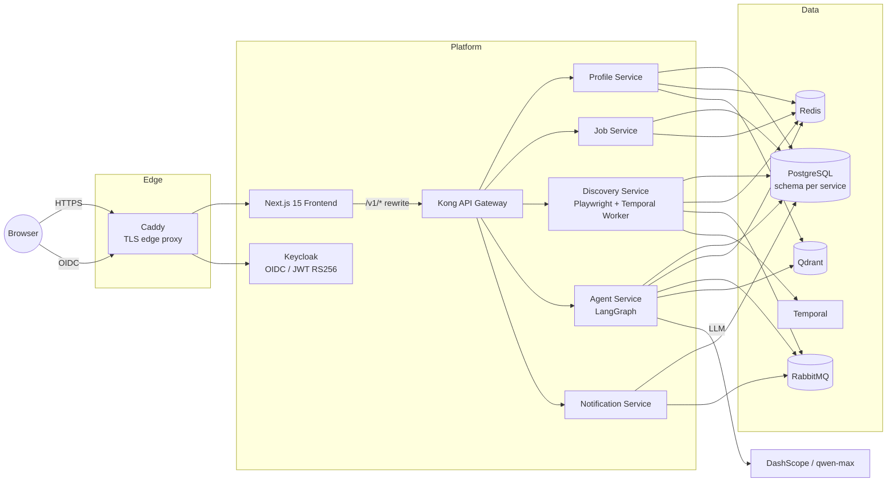

# JobCopilot

**An AI-powered job-search management platform** — multi-agent architecture (LangGraph) that discovers jobs from public job boards, matches them against your resume, and manages the full application pipeline through natural language. Add any posting from any site via URL, pasted JD text, or a screenshot.

**AI 驱动的智能求职管理平台** —— 基于多 Agent 架构（LangGraph），自动从公开职位源发现岗位、与简历智能匹配，并通过自然语言管理完整投递流程。任意站点的岗位均可通过 URL、粘贴 JD 文本或截图录入。

> **Status / 状态：** The v0.2 re-scope (credential-free public-source discovery, JD paste/screenshot entries) is being implemented — see [`docs/PRD.md`](docs/PRD.md) for the authoritative scope. / v0.2 重构（无凭证公开源爬取、JD 粘贴/截图录入）实施中——权威范围见 [`docs/PRD.md`](docs/PRD.md)。

---

## 1. What It Does / 功能概览

**EN:**
- **Job discovery** — crawling of public, no-login job boards on Temporal schedules; **no account credentials are ever collected**. Any posting (including from login-walled sites) can be added manually via URL, pasted JD text, or a screenshot — three mutually-fallback entry paths.
- **AI analysis & matching** — LangGraph agent pipelines structure job descriptions, score them against the user's resume (Qdrant vector search), and suggest resume tailoring and interview prep.
- **Application pipeline** — Kanban-style tracking from *discovered* to *offer*, with a full status state machine and event history.
- **Global AI assistant** — a ReAct agent (Vercel AI SDK + SSE streaming) that can trigger any platform action through chat.
- **Open source, two deployment modes** — self-hosted (bring your own OpenAI-compatible LLM key) or the official hosted site (platform-provided LLM). Tenant identity travels in the JWT (Keycloak); every tenant-scoped query is filtered at the repository layer.

**中文：**
- **职位发现** —— 爬取无需登录的公开职位源，由 Temporal 定时调度；**绝不收集用户账号凭证**。任意岗位（含登录墙站点）可经 URL、粘贴 JD 文本或截图三条互为兜底的路径手动录入。
- **AI 分析与匹配** —— LangGraph Agent 流水线结构化 JD、与用户简历打分匹配（Qdrant 向量检索），并给出简历改写与面试准备建议。
- **投递流程管理** —— 看板式跟踪从「已发现」到「Offer」的全流程，内置完整状态机与事件历史。
- **全局 AI 助手** —— ReAct Agent（Vercel AI SDK + SSE 流式输出），通过对话触发平台任意操作。
- **开源，双部署形态** —— 自部署（自配 OpenAI 兼容 LLM Key）或官方托管站（平台提供 LLM）。租户身份随 JWT（Keycloak）传递，所有租户数据在仓库层强制过滤。

---

## 2. Architecture / 架构



**EN:** Kong fronts all APIs (no service is internet-facing); JWTs are validated in every service against Keycloak's JWKS with issuer/audience checks; each service owns its PostgreSQL schema (cross-schema JOINs forbidden); all services are stateless. Full design: [`docs/SAD.md`](docs/SAD.md) · Product requirements: [`docs/PRD.md`](docs/PRD.md).

**中文：** Kong 统一收口全部 API（任何服务不直接暴露公网）；每个服务基于 Keycloak JWKS 校验 JWT（含 issuer/audience 检查）；每个服务独占自己的 PostgreSQL schema（禁止跨 schema JOIN）；服务全部无状态。完整设计见 [`docs/SAD.md`](docs/SAD.md)，产品需求见 [`docs/PRD.md`](docs/PRD.md)。

---

## 3. Tech Stack / 技术栈

| Layer | Choices |
|---|---|
| **Backend** | Python 3.11 · FastAPI · SQLAlchemy 2 (async) · Alembic · uv workspace |
| **AI** | LangGraph (stateful graphs + ReAct) · DashScope (qwen-max) · Qdrant · LangSmith |
| **Workflow / Messaging** | Temporal (durable scheduling) · RabbitMQ · Redis |
| **Frontend** | Next.js 15 (App Router) · TypeScript · Tailwind + shadcn/ui · Vercel AI SDK · TanStack Query · Zustand |
| **Platform** | Kong 3.x · Keycloak 26 (OIDC) · Docker Compose · Kubernetes manifests (`infra/k8s/`) |
| **Observability** | Prometheus (`jobcopilot_*` metrics) · Loki + Grafana Alloy (logs) · Grafana dashboards-as-code · LangSmith (LLM traces) |
| **Security** | AES-256-GCM secret encryption · gitleaks · Trivy (Critical CVE blocks CI) · non-root images |
| **CI/CD** | GitHub Actions — lint/type/test/scan → GHCR images → digest-pinned deploys with rollback |

---

## 4. Quick Start / 快速开始

**EN:** Requires Docker Compose ≥ 2.24. The full stack (5 services + frontend + all infrastructure) runs locally:

**中文：** 需要 Docker Compose ≥ 2.24。一条命令在本地拉起完整技术栈（5 个微服务 + 前端 + 全部基础设施）：

```bash
cd infra
cp .env.example .env        # fill in at least ENCRYPTION_KEY (see file comments)
docker compose up --build -d
```

| URL | What |
|---|---|
| http://localhost:3000 | Frontend |
| http://localhost:8000 | Kong gateway (`/v1/*` APIs) |
| http://localhost:8080 | Keycloak (admin: `admin`/`admin`, dev only) |
| http://localhost:8233 | Temporal UI |

**Run checks / 本地检查:**

```bash
~/.local/bin/uv run ruff check . && ~/.local/bin/uv run ruff format --check .
~/.local/bin/uv run mypy services/<name>/
~/.local/bin/uv run pytest packages/ services/ -m "not integration"
cd frontend && npm ci && npm run lint && npm run type-check
```

---

## 5. Repository Layout / 目录结构

```
services/           # 5 FastAPI microservices (profile, job, discovery, agent, notification)
  agent/graphs/     #   LangGraph graphs: Analyzer, Resume, Interview, ReAct
packages/shared/    # Shared auth (JWT/JWKS), crypto, logging, models
frontend/           # Next.js 15 app (App Router, SSE chat, Kanban board)
infra/
  docker-compose.yml        # Local dev — full stack
  docker-compose.prod.yml   # Production overlay (Caddy TLS, loopback binds, digest pins)
  k8s/                      # Kubernetes manifests (NetworkPolicies, HPA, kustomize)
  scripts/deploy.sh         # Digest-pinned deploy + rollback to any green commit
docs/               # PRD + Software Architecture Design (bilingual)
```

---

## 6. Production Deployment / 生产部署

**EN:** Single-node deployment (tested on Hetzner): CI builds and Trivy-scans images to GHCR on every green `main` commit; [`infra/scripts/deploy.sh`](infra/scripts/deploy.sh) verifies the commit's CD run is green, resolves image tags to **immutable digests**, ships config over SSH, and starts the stack behind Caddy (automatic Let's Encrypt TLS). Every internal service is bound to loopback; only 80/443 are public. Rollback = redeploy any older green commit.

**中文：** 单节点部署（Hetzner 实测）：CI 在每个绿色 `main` 提交上构建镜像、经 Trivy 扫描后推送 GHCR；[`infra/scripts/deploy.sh`](infra/scripts/deploy.sh) 先校验该提交的 CD 流水线为绿色，再将镜像 tag 解析为**不可变 digest**、经 SSH 下发配置，并在 Caddy（自动 Let's Encrypt TLS）之后启动整个栈。所有内部服务仅绑定回环地址，公网只开放 80/443。回滚 = 重新部署任意历史绿色提交。

---

## License / 许可证

[MIT](LICENSE)
