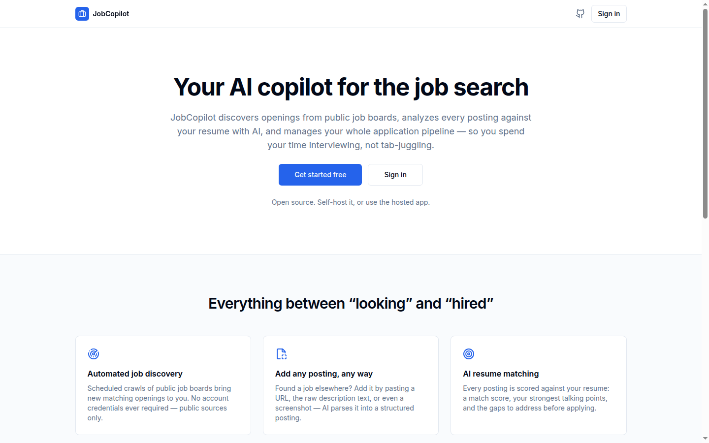
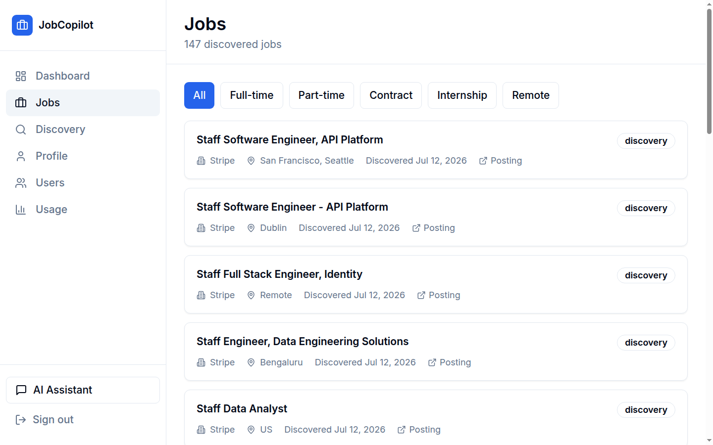
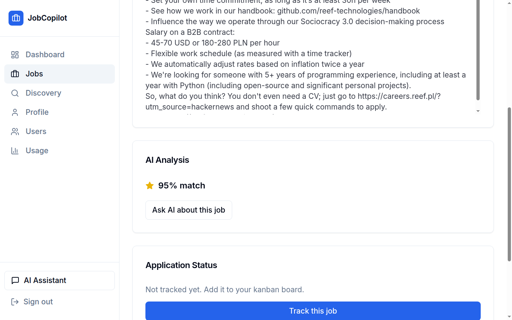
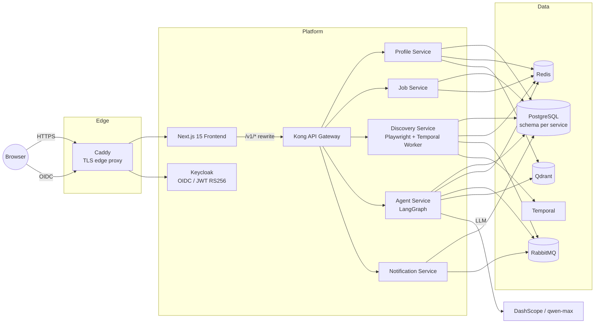

<div align="center">

# JobCopilot

**Your AI copilot for the job search** — discovers openings from public job boards, scores every posting against your resume, and manages your whole application pipeline through natural language.

[](https://github.com/shangxiang0907/JobCopilot/actions/workflows/ci.yml)
[](https://github.com/shangxiang0907/JobCopilot/actions/workflows/cd.yml)
[](LICENSE)


**[🌐 Live Demo](https://jobcopilot.arnoldshang.com)** · [Features](#features) · [Architecture](#architecture) · [Quick Start](#quick-start) · [**中文文档**](README.zh-CN.md)



</div>

---

## Features

- 🔍 **Automated job discovery** — scheduled crawls (Temporal) of public, no-login job boards; **no account credentials are ever collected**
- 📥 **Add any posting, any way** — paste a URL, the raw JD text, or even a screenshot (parsed by a vision model); three mutually-fallback entry paths cover login-walled sites too
- 🎯 **AI analysis & matching** — LangGraph agent pipelines structure each JD and score it against your resume (Qdrant vector search), with resume-tailoring and interview-prep suggestions
- 📋 **Application pipeline** — Kanban-style tracking from *discovered* to *offer*, backed by a full status state machine and event history
- 💬 **Global AI assistant** — a ReAct agent (Vercel AI SDK + SSE streaming) that can trigger any platform action through chat
- 🔓 **Open source, two deployment modes** — self-host with your own OpenAI-compatible LLM key, or use the hosted site with the platform key (per-user daily AI quota)

<table>
  <tr>
    <td align="center"><b>Discovered jobs</b></td>
    <td align="center"><b>AI match analysis</b></td>
  </tr>
  <tr>
    <td></td>
    <td></td>
  </tr>
</table>

---

## Architecture



Kong fronts all APIs (no service is internet-facing); JWTs are validated in every service against Keycloak's JWKS with issuer/audience checks; each service owns its PostgreSQL schema (cross-schema JOINs forbidden); all services are stateless. Tenant identity travels in the JWT — every tenant-scoped query is filtered at the repository layer.

Full design: [`docs/SAD.md`](docs/SAD.md) · Product requirements: [`docs/PRD.md`](docs/PRD.md) · Operator observability guide: [`docs/OBSERVABILITY.md`](docs/OBSERVABILITY.md)

---

## Tech Stack

| Layer | Choices |
|---|---|
| **Backend** | Python 3.11 · FastAPI · SQLAlchemy 2 (async) · Alembic · uv workspace |
| **AI** | LangGraph (stateful graphs + ReAct) · DashScope (qwen-max) · Qdrant · LangSmith |
| **Workflow / Messaging** | Temporal (durable scheduling) · RabbitMQ · Redis |
| **Frontend** | Next.js 15 (App Router) · TypeScript · Tailwind + shadcn/ui · Vercel AI SDK · TanStack Query · Zustand |
| **Platform** | Kong 3.x · Keycloak 26 (OIDC) · Docker Compose · Kubernetes manifests (`infra/k8s/`) |
| **Observability** | Prometheus (`jobcopilot_*` metrics) · Loki + Grafana Alloy (logs) · Grafana dashboards-as-code · LangSmith (LLM traces) |
| **Security** | AES-256-GCM secret encryption · gitleaks · Trivy (Critical CVE blocks CI) · non-root images |
| **CI/CD** | GitHub Actions — lint/type/test/scan → GHCR images → digest-pinned deploys with rollback |

---

## Quick Start

Requires Docker Compose ≥ 2.24. The full stack (5 microservices + frontend + all infrastructure) runs locally:

```bash
cd infra
cp .env.e2e .env            # local template (loopback URLs, dummy secrets);
                            # add a real DASHSCOPE_API_KEY for AI features.
                            # .env.example is the PRODUCTION template — do not
                            # use it for local runs.
docker compose up --build -d
```

| URL | What |
|---|---|
| http://localhost:3000 | Frontend |
| http://localhost:8000 | Kong gateway (`/v1/*` APIs) |
| http://localhost:8080 | Keycloak (admin: `admin`/`admin`, dev only) |
| http://localhost:8233 | Temporal UI |

**Run checks locally:**

```bash
~/.local/bin/uv run ruff check . && ~/.local/bin/uv run ruff format --check .
~/.local/bin/uv run mypy services/<name>/
~/.local/bin/uv run pytest packages/ services/ -m "not integration"
cd frontend && npm ci && npm run lint && npm run type-check
```

---

## Repository Layout

```
services/           # 5 FastAPI microservices (profile, job, discovery, agent, notification)
  agent/graphs/     #   LangGraph graphs: Analyzer, Resume, Interview, ReAct
packages/shared/    # Shared auth (JWT/JWKS), crypto, logging, models
frontend/           # Next.js 15 app (App Router, SSE chat, Kanban board)
infra/
  docker-compose.yml        # Local dev — full stack
  docker-compose.prod.yml   # Production overlay (Caddy TLS, loopback binds, digest pins)
  k8s/                      # Kubernetes manifests (NetworkPolicies, HPA, kustomize)
  scripts/deploy.sh         # Digest-pinned deploy + rollback to any green commit
docs/               # PRD + Software Architecture Design (bilingual)
```

---

## Production Deployment

Single-node deployment (running live on Hetzner): CI builds and Trivy-scans images to GHCR on every green `main` commit; [`infra/scripts/deploy.sh`](infra/scripts/deploy.sh) verifies the commit's CD run is green, resolves image tags to **immutable digests**, ships config over SSH, and starts the stack behind Caddy (automatic Let's Encrypt TLS). Every internal service is bound to loopback; only 80/443 are public. Every image is stamped with its git revision (`/healthz/*` and `/metrics` expose it), and the deploy script fails on any revision mismatch. Rollback = redeploy any older green commit.

---

## License

[MIT](LICENSE)
