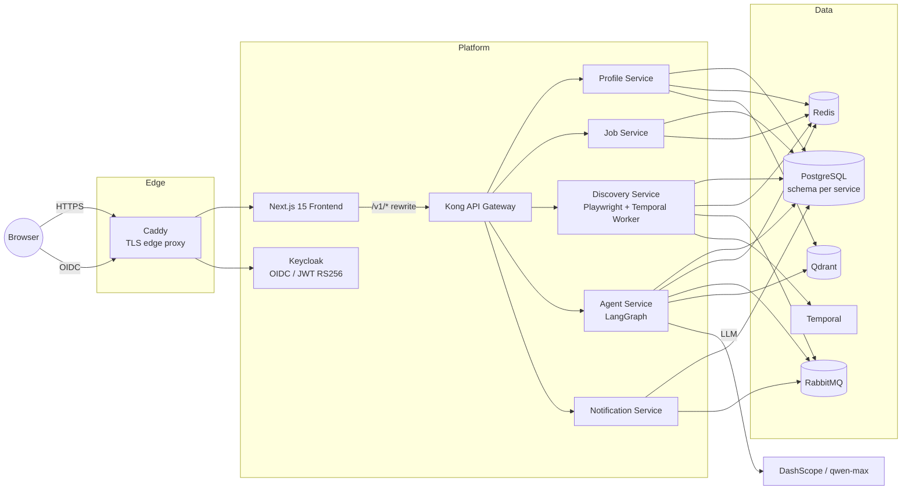

<div align="center">

# JobCopilot

**你的 AI 求职副驾** —— 自动从公开职位源发现岗位、将每条职位与你的简历智能匹配打分，并通过自然语言管理完整投递流程。

[](https://github.com/shangxiang0907/JobCopilot/actions/workflows/ci.yml)
[](https://github.com/shangxiang0907/JobCopilot/actions/workflows/cd.yml)
[](LICENSE)


**[🌐 在线体验](https://jobcopilot.arnoldshang.com)** · [功能特性](#功能特性) · [系统架构](#系统架构) · [快速开始](#快速开始) · [**English**](README.md)


</div>

---

## 功能特性

- 🔍 **自动职位发现** —— 由 Temporal 定时调度，爬取无需登录的公开职位源；**绝不收集用户账号凭证**
- 📥 **任意岗位、任意方式录入** —— 粘贴 URL、JD 原文，甚至一张截图（视觉模型解析）；三条互为兜底的录入路径，登录墙站点同样覆盖
- 🎯 **AI 分析与匹配** —— LangGraph Agent 流水线结构化每条 JD，并与你的简历打分匹配（Qdrant 向量检索），附带简历改写与面试准备建议
- 📋 **投递流程管理** —— 看板式跟踪从「已发现」到「Offer」的全流程，内置完整状态机与事件历史
- 💬 **全局 AI 助手** —— ReAct Agent（Vercel AI SDK + SSE 流式输出），通过对话触发平台任意操作
- 🔓 **开源，双部署形态** —— 自部署（自配 OpenAI 兼容 LLM Key），或使用官方托管站（平台 Key，按用户每日 AI 配额）

<table>
  <tr>
    <td align="center"><b>已发现职位</b></td>
    <td align="center"><b>AI 匹配分析</b></td>
  </tr>
  <tr>
    <td></td>
    <td></td>
  </tr>
</table>

---

## 系统架构



Kong 统一收口全部 API（任何服务不直接暴露公网）；每个服务基于 Keycloak JWKS 校验 JWT（含 issuer/audience 检查）；每个服务独占自己的 PostgreSQL schema（禁止跨 schema JOIN）；服务全部无状态。租户身份随 JWT 传递——所有租户数据在仓库层强制过滤。

完整设计见 [`docs/SAD.md`](docs/SAD.md) · 产品需求见 [`docs/PRD.md`](docs/PRD.md) · 运营者可观测性指南见 [`docs/OBSERVABILITY.md`](docs/OBSERVABILITY.md)

---

## 技术栈

| 层 | 选型 |
|---|---|
| **后端** | Python 3.11 · FastAPI · SQLAlchemy 2（async）· Alembic · uv workspace |
| **AI** | LangGraph（有状态图 + ReAct）· DashScope（qwen-max）· Qdrant · LangSmith |
| **工作流 / 消息** | Temporal（持久化调度）· RabbitMQ · Redis |
| **前端** | Next.js 15（App Router）· TypeScript · Tailwind + shadcn/ui · Vercel AI SDK · TanStack Query · Zustand |
| **平台** | Kong 3.x · Keycloak 26（OIDC）· Docker Compose · Kubernetes 清单（`infra/k8s/`） |
| **可观测性** | Prometheus（`jobcopilot_*` 指标）· Loki + Grafana Alloy（日志）· Grafana 仪表盘即代码 · LangSmith（LLM 追踪） |
| **安全** | AES-256-GCM 密钥加密 · gitleaks · Trivy（Critical CVE 阻断 CI）· 非 root 镜像 |
| **CI/CD** | GitHub Actions —— lint/类型/测试/扫描 → GHCR 镜像 → digest 锁定部署与回滚 |

---

## 快速开始

需要 Docker Compose ≥ 2.24。一条命令在本地拉起完整技术栈（5 个微服务 + 前端 + 全部基础设施）：

```bash
cd infra
cp .env.e2e .env            # 本地模板（回环地址、占位密钥）；
                            # AI 功能需填入真实 DASHSCOPE_API_KEY。
                            # .env.example 是生产模板——不要用于本地。
docker compose up --build -d
```

| URL | 说明 |
|---|---|
| http://localhost:3000 | 前端 |
| http://localhost:8000 | Kong 网关（`/v1/*` API） |
| http://localhost:8080 | Keycloak（管理员：`admin`/`admin`，仅限开发环境） |
| http://localhost:8233 | Temporal UI |

**本地检查：**

```bash
~/.local/bin/uv run ruff check . && ~/.local/bin/uv run ruff format --check .
~/.local/bin/uv run mypy services/<name>/
~/.local/bin/uv run pytest packages/ services/ -m "not integration"
cd frontend && npm ci && npm run lint && npm run type-check
```

---

## 目录结构

```
services/           # 5 个 FastAPI 微服务（profile、job、discovery、agent、notification）
  agent/graphs/     #   LangGraph 图：Analyzer、Resume、Interview、ReAct
packages/shared/    # 共享库：认证（JWT/JWKS）、加密、日志、模型
frontend/           # Next.js 15 应用（App Router、SSE 聊天、看板）
infra/
  docker-compose.yml        # 本地开发——完整技术栈
  docker-compose.prod.yml   # 生产覆盖层（Caddy TLS、回环绑定、digest 锁定）
  k8s/                      # Kubernetes 清单（NetworkPolicy、HPA、kustomize）
  scripts/deploy.sh         # digest 锁定部署 + 回滚到任意绿色提交
docs/               # PRD + 软件架构设计（双语）
```

---

## 生产部署

单节点部署（Hetzner 线上运行中）：CI 在每个绿色 `main` 提交上构建镜像、经 Trivy 扫描后推送 GHCR；[`infra/scripts/deploy.sh`](infra/scripts/deploy.sh) 先校验该提交的 CD 流水线为绿色，再将镜像 tag 解析为**不可变 digest**、经 SSH 下发配置，并在 Caddy（自动 Let's Encrypt TLS）之后启动整个栈。所有内部服务仅绑定回环地址，公网只开放 80/443。每个镜像都烙有其 git 版本号（`/healthz/*` 与 `/metrics` 可查），部署脚本在任何版本不一致时直接失败。回滚 = 重新部署任意历史绿色提交。

---

## 许可证

[MIT](LICENSE)
