# JobCopilot — Software Architecture Design / 软件架构设计

Version / 版本：v0.1  
Status / 状态：Draft / 草稿  
Last Updated / 最后更新：2026-06-10

---

## 1. System Overview / 系统概述

**EN:**  
JobCopilot is built on a microservices architecture with five application services behind a Kong API Gateway, a Keycloak-backed authentication layer, and a multi-agent AI pipeline powered by LangGraph and orchestrated by Temporal. The frontend is a Next.js 15 application. All services are designed for horizontal scaling on Kubernetes.

**中文：**  
JobCopilot 采用微服务架构，Kong API Gateway 后方部署五个应用服务，通过 Keycloak 实现身份认证，AI 流水线基于 LangGraph 多 Agent 图并由 Temporal 负责工作流编排。前端为 Next.js 15 应用。所有服务均以水平扩展为目标，运行于 Kubernetes 之上。

---

## 2. C4 Architecture Views / C4 架构视图

### 2.1 Level 1 — System Context / 系统上下文

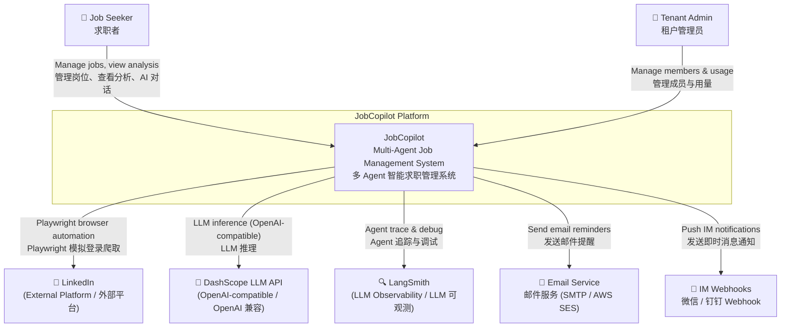

### 2.2 Level 2 — Container Diagram / 容器图

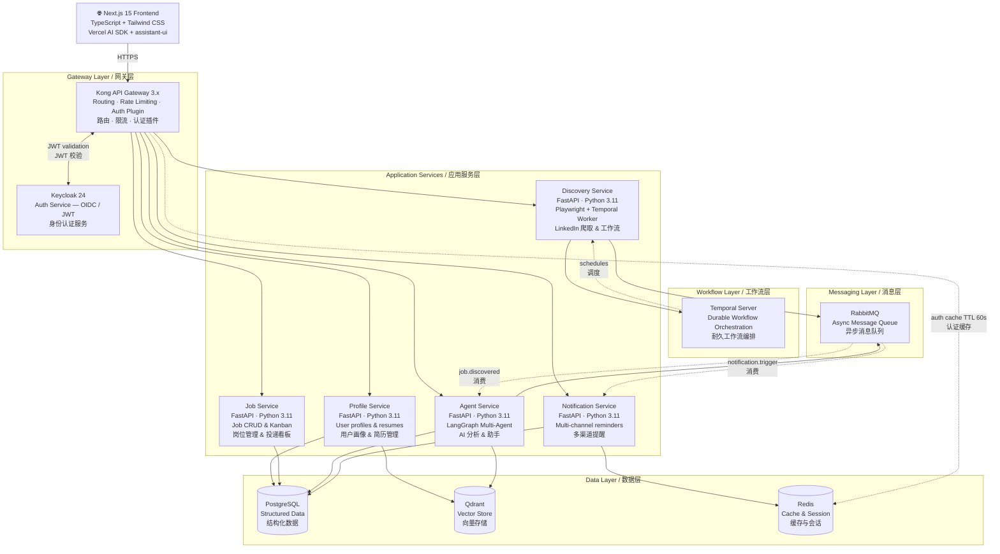

### 2.3 Level 3 — Agent Service Components / Agent Service 组件图

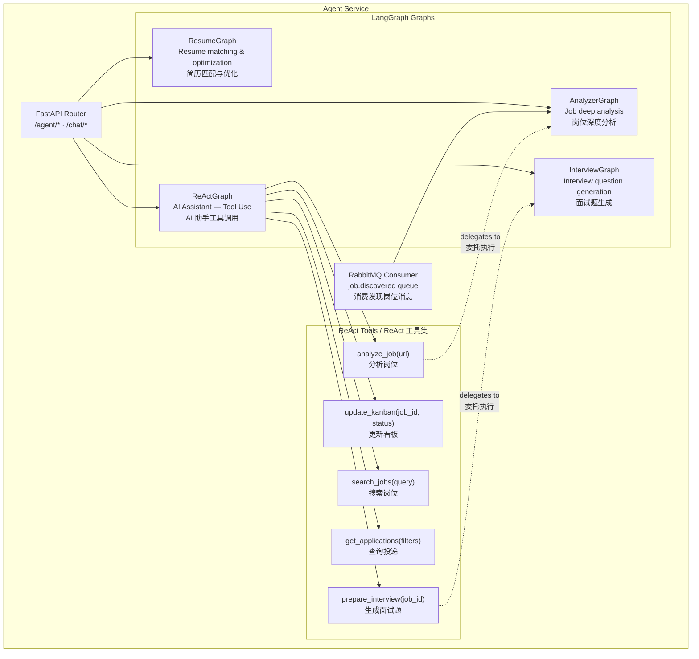

---

## 3. AI Agent Architecture / AI Agent 体系

**EN:**  
Four LangGraph graphs share a common DashScope LLM client. Temporal handles durability and scheduling; LangGraph handles agent reasoning logic. These two frameworks are complementary, not competing.

**中文：**  
四个 LangGraph 图共享同一个 DashScope LLM 客户端。Temporal 负责耐久性与调度，LangGraph 负责 Agent 推理逻辑，两者互补而非竞争。

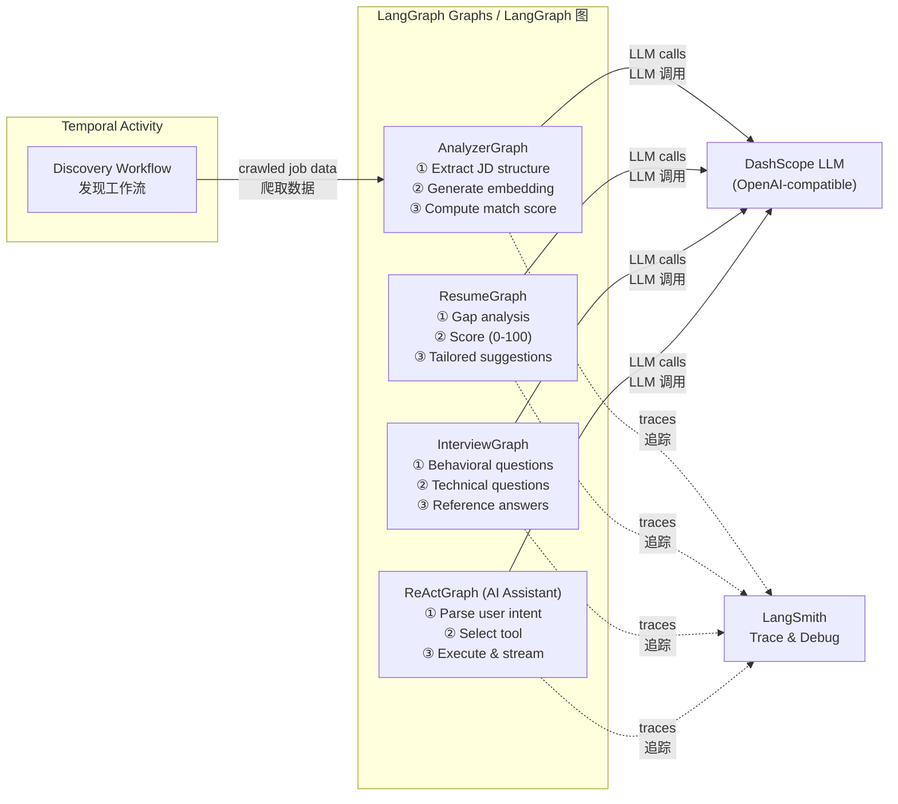

---

## 4. Temporal Workflow Design / Temporal 工作流设计

**EN:**  
Discovery workflows are the primary use of Temporal. Each Activity is independently retryable with configurable backoff, so a transient LinkedIn failure does not re-crawl from the beginning.

**中文：**  
岗位发现工作流是 Temporal 的主要应用场景。每个 Activity 均可独立重试并配置退避策略，LinkedIn 暂时性失败不会导致从头重爬。

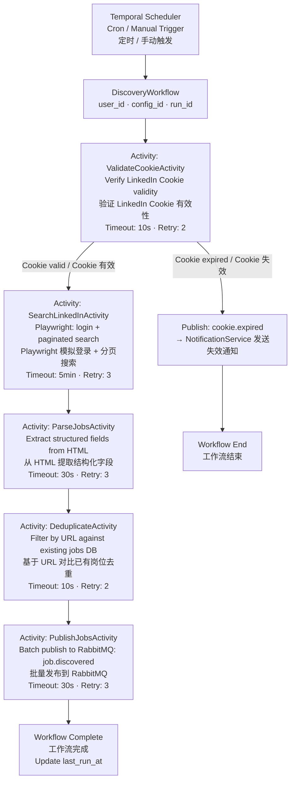

---

## 5. Key Sequence Diagrams / 关键流程时序图

### 5.1 Auto Job Discovery / 自动岗位发现

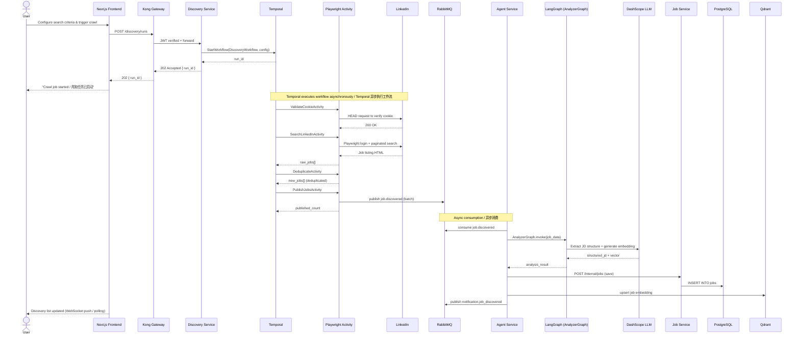

### 5.2 AI Assistant Tool Call / AI 助手工具调用

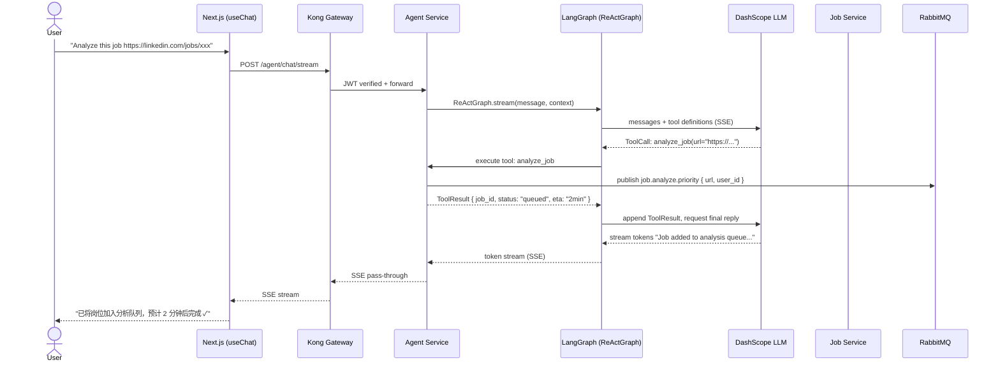

### 5.3 Resume Matching Analysis / 简历匹配分析

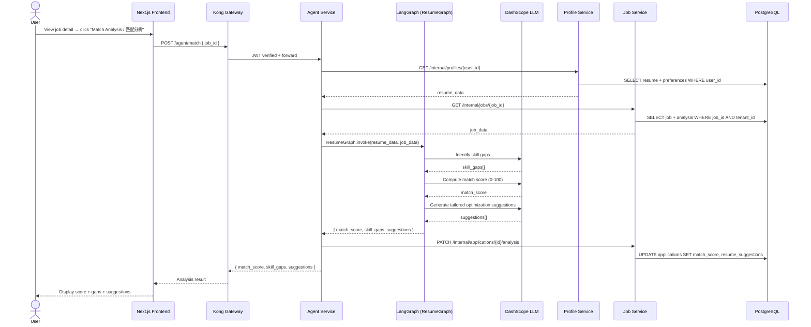

### 5.4 Notification Reminder Trigger / 通知提醒触发

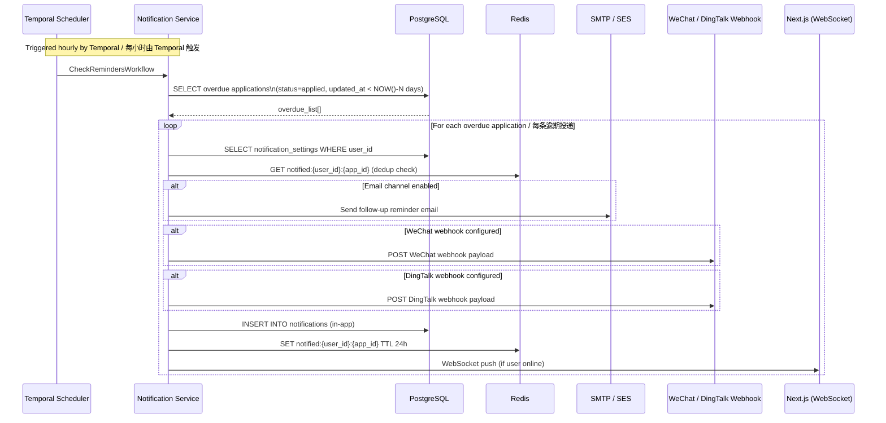

---

## 6. Application Status Machine / 投递状态机

**EN:**  
All status transitions are persisted to `application_events` with a timestamp. Transitions from `Rejected` and `Withdrawn` are terminal.

**中文：**  
所有状态转换均记录到 `application_events` 表并附时间戳。`Rejected` 和 `Withdrawn` 为终止状态。

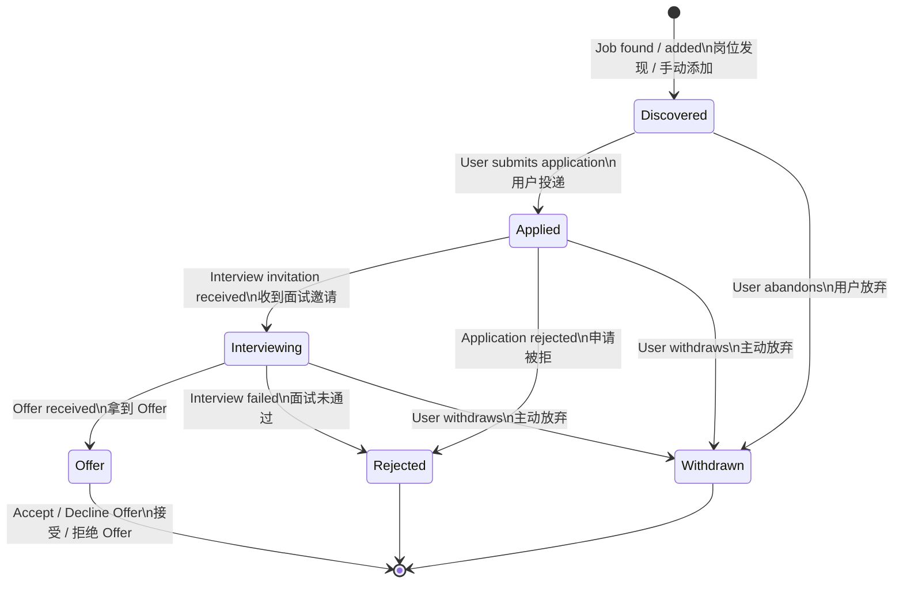

---

## 7. Data Model / 数据模型

**EN:**  
All tables include `tenant_id` where applicable. Every query against tenant-scoped tables **must** include `WHERE tenant_id = :tenant_id`. Cross-schema JOINs are forbidden; inter-service data exchange uses internal APIs.

**中文：**  
所有表在适用时均含 `tenant_id`。针对租户范围表的每条查询**必须**包含 `WHERE tenant_id = :tenant_id`。禁止跨 Schema JOIN，服务间数据交换通过内部 API 进行。

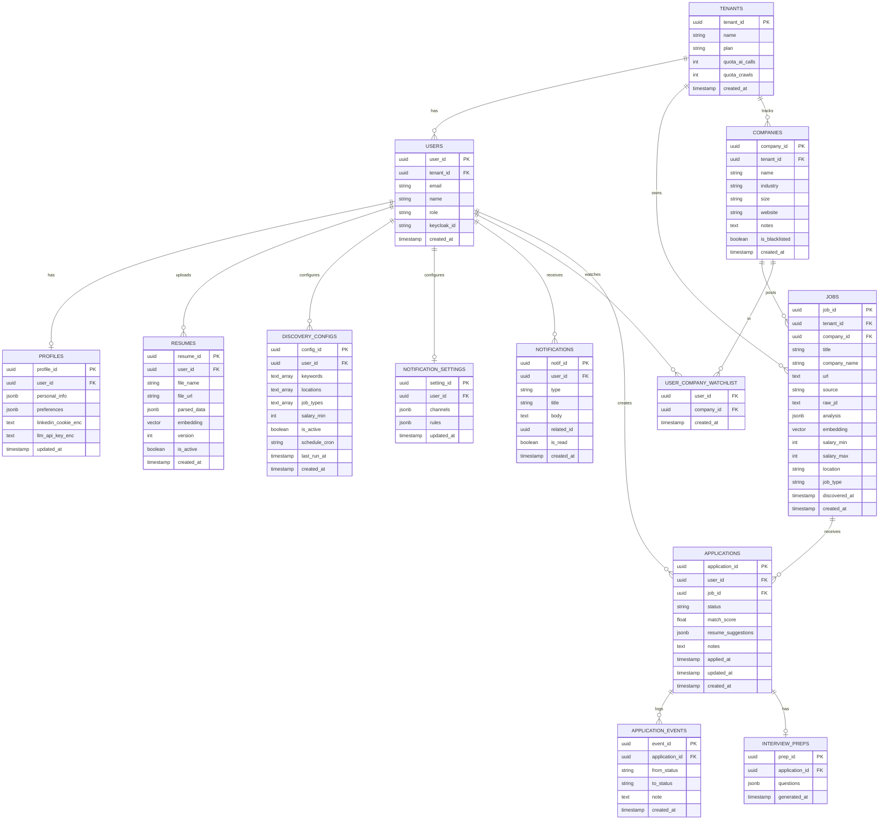

---

## 8. Inter-Service Communication / 服务间通信规范

**EN:**

| Pattern | Usage | Details |
|---|---|---|
| Sync (internal) | Service-to-service API calls | Via K8s DNS (not through Kong); timeout 500ms |
| Async | Job discovery → AI analysis | RabbitMQ `job.discovered` queue; at-least-once delivery |
| Async | AI analysis done → notification | RabbitMQ `notification.trigger` queue |
| Streaming | AI chat responses | Server-Sent Events (SSE) from Agent Service |
| Push | Real-time in-app notifications | WebSocket from Notification Service |

**中文：**

| 模式 | 用途 | 详细 |
|---|---|---|
| 同步（内部） | 服务间 API 调用 | 通过 K8s DNS（不经 Kong）；超时 500ms |
| 异步 | 岗位发现 → AI 分析 | RabbitMQ `job.discovered` 队列；at-least-once 投递 |
| 异步 | AI 分析完成 → 通知 | RabbitMQ `notification.trigger` 队列 |
| 流式 | AI 聊天响应 | Agent Service 输出 SSE |
| 推送 | 实时站内通知 | Notification Service 维持 WebSocket |

**Queue Definitions / 队列定义：**

| Queue | Producer | Consumer | Dead Letter Queue |
|---|---|---|---|
| `job.discovered` | Discovery Service | Agent Service | `job.discovered.dlq` |
| `job.analyze.priority` | Agent Service (chat tool) | Agent Service | `job.analyze.dlq` |
| `notification.trigger` | Agent Service | Notification Service | `notification.dlq` |
| `cookie.expired` | Discovery Service | Notification Service | — |

---

## 9. Observability Design / 可观测性设计

**EN:**  
All services implement the three pillars of observability. Metric names are prefixed with `jobcopilot_`. LangGraph traces are additionally forwarded to LangSmith for AI-specific debugging.

**中文：**  
所有服务实现可观测性三支柱。指标名称统一前缀 `jobcopilot_`。LangGraph 追踪额外转发至 LangSmith 用于 AI 专项调试。

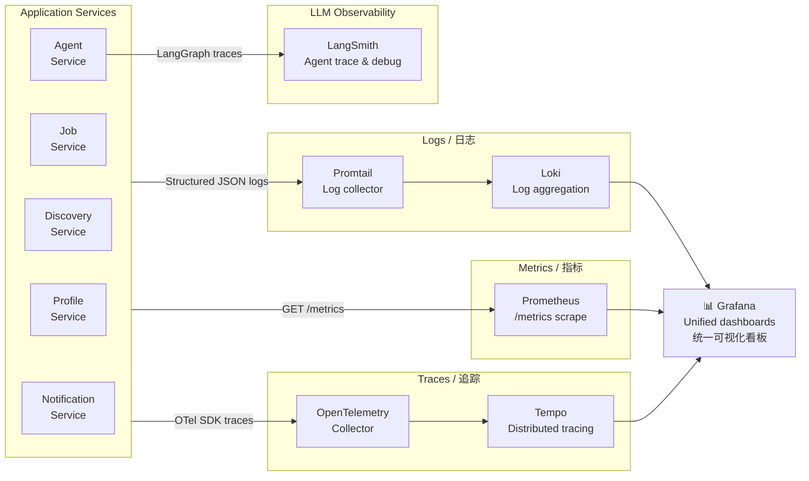

**Required Metrics / 必需指标：**

| Metric | Type | Description |
|---|---|---|
| `jobcopilot_http_requests_total` | Counter | Total HTTP requests by service/endpoint/status |
| `jobcopilot_http_request_duration_seconds` | Histogram | Request latency |
| `jobcopilot_llm_calls_total` | Counter | Total LLM calls by graph/model |
| `jobcopilot_llm_call_duration_seconds` | Histogram | LLM call latency |
| `jobcopilot_crawl_jobs_discovered_total` | Counter | Jobs discovered per crawl run |
| `jobcopilot_mq_messages_consumed_total` | Counter | RabbitMQ messages consumed by queue |
| `jobcopilot_active_temporal_workflows` | Gauge | Active Temporal workflow count |

---

## 10. Security Design / 安全设计

**EN:**

| Area | Requirement |
|---|---|
| Authentication | Keycloak 24 OIDC; JWT RS256; access token TTL 15 min; refresh token TTL 7 days |
| Authorization | RBAC: Admin / Member roles; all queries include `tenant_id` filter |
| Credential storage | LinkedIn Cookie and API Keys encrypted with AES-256-GCM before persistence; plaintext never logged |
| Cookie revocation | Cookie marked invalid within 60 s across all replicas (Redis cache TTL ≤ 60 s) |
| API Key storage | Bcrypt or Argon2 hash; no MD5 / SHA-1; no plaintext in DB or Git |
| SQL injection | Parameterized queries (SQLAlchemy prepared statements) everywhere; string-interpolated SQL is forbidden |
| Input validation | Pydantic schema validation on all API inputs; malformed requests rejected at the API layer |
| Container security | Multi-stage Dockerfile; production stage uses `python:3.11-slim`; runs as non-root (`uid=1000`) |
| Secrets management | All secrets injected via environment variables / K8s Secrets; never baked into images or committed to Git |
| Network policy | K8s NetworkPolicy: services only accept traffic from their allowed callers |
| Rate limiting | Kong rate-limiting plugin: per-tenant sliding window |

**中文：**

| 领域 | 要求 |
|---|---|
| 认证 | Keycloak 24 OIDC；JWT RS256；访问令牌 TTL 15 分钟；刷新令牌 TTL 7 天 |
| 授权 | RBAC：Admin / Member 角色；所有查询必须含 `tenant_id` 过滤条件 |
| 凭证存储 | LinkedIn Cookie 与 API Key 持久化前 AES-256-GCM 加密；明文绝不写入日志 |
| Cookie 吊销 | 60 秒内在所有副本上生效（Redis 缓存 TTL ≤ 60 s） |
| SQL 注入防护 | 全链路 SQLAlchemy 参数化查询；禁止字符串拼接 SQL |
| 输入校验 | 所有 API 入参 Pydantic 校验；格式非法请求在 API 层拒绝 |
| 容器安全 | 多阶段 Dockerfile；生产阶段 `python:3.11-slim`；非 root 用户运行（uid=1000） |
| 密钥管理 | 所有密钥通过环境变量 / K8s Secrets 注入；禁止打入镜像或提交 Git |
| 网络隔离 | K8s NetworkPolicy：每个服务只接受来自授权调用方的流量 |
| 限流 | Kong rate-limiting 插件：按租户滑动窗口限流 |

---

## 11. Deployment Architecture / 部署架构

**EN:**  
All workloads run on Kubernetes. The frontend is served as a static Next.js build. Agent Service scales via KEDA based on RabbitMQ queue depth. Profile and Job Services scale via HPA based on CPU.

**中文：**  
所有工作负载运行于 Kubernetes 之上。前端以 Next.js 静态构建产物方式服务。Agent Service 基于 RabbitMQ 队列积压深度由 KEDA 弹性伸缩；Profile Service 和 Job Service 基于 CPU 由 HPA 伸缩。

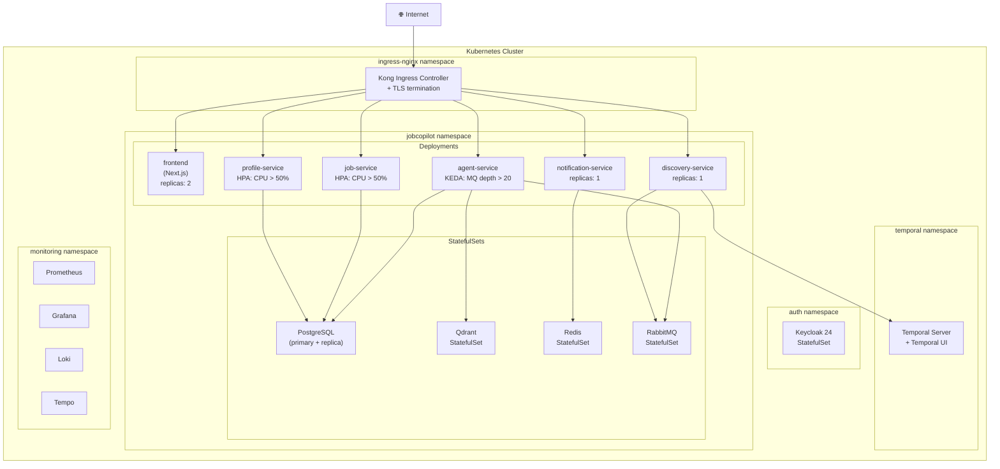

**K8s Resource Checklist / K8s 资源清单要求：**

Every application service must provide / 每个应用服务须提供：
- `Deployment` with `terminationGracePeriodSeconds ≥ 30`
- `Service` (ClusterIP)
- `ConfigMap` (non-secret config)
- `HPA` or `ScaledObject` (KEDA)
- `PodDisruptionBudget` (minAvailable: 1)
- `Ingress` / `HTTPRoute` (via Kong)
- Liveness probe: `GET /healthz/live`
- Readiness probe: `GET /healthz/ready`

---

## 12. Architecture Decision Records / 架构决策记录 (ADR)

### ADR-001: LangGraph for AI Agent Orchestration

**EN:** LangGraph is selected because it provides stateful, graph-based agent execution with conditional edges, native streaming, and first-class LangSmith tracing integration. Alternatives (vanilla LangChain chains, AutoGen) lack the same level of controllability and observability.

**中文：** 选用 LangGraph，因为它提供有状态的图式 Agent 执行、条件边、原生流式输出，以及与 LangSmith 的一等公民追踪集成。备选方案（原生 LangChain chains、AutoGen）在可控性和可观测性上不及此方案。

---

### ADR-002: Temporal for Workflow Orchestration

**EN:** Temporal handles durable execution for long-running LinkedIn crawl workflows. It provides built-in retry semantics, timeouts, and visibility—replacing fragile ad-hoc retry loops. LangGraph and Temporal are used together: Temporal manages workflow lifecycle; LangGraph runs within Temporal Activities for AI reasoning.

**中文：** Temporal 负责长时运行的 LinkedIn 爬取工作流的耐久执行，提供内建重试语义、超时控制和可见性，取代脆弱的自定义重试逻辑。Temporal 与 LangGraph 配合使用：Temporal 管理工作流生命周期，LangGraph 在 Temporal Activity 内执行 AI 推理。

---

### ADR-003: Qdrant for Vector Storage

**EN:** Qdrant is chosen over pgvector because it provides dedicated ANN indexing, multi-tenancy via named collections or payload filters, and scales independently of the relational database. pgvector remains available via PostgreSQL for lightweight similarity needs.

**中文：** 选用 Qdrant 而非 pgvector，因为 Qdrant 提供专用 ANN 索引、通过命名集合或 payload 过滤实现多租户隔离，并可独立于关系型数据库扩展。pgvector 仍通过 PostgreSQL 保留，用于轻量级相似度需求。

---

### ADR-004: Per-User LinkedIn Cookie (Not Shared Account)

**EN:** Each user supplies their own LinkedIn Session Cookie. This eliminates single-account ban risk, ensures personalized search results, and removes the legal/ethical concern of a shared scraped account. Cookies are encrypted with AES-256-GCM before persistence.

**中文：** 每个用户提供自己的 LinkedIn Session Cookie，而非共用账号。这消除了单账号被封的风险，确保个性化搜索结果，也避免了共享爬取账号的法律/道德风险。Cookie 在持久化前经 AES-256-GCM 加密。

---

### ADR-005: Vercel AI SDK + assistant-ui for Chat Frontend

**EN:** Vercel AI SDK (`useChat`) handles the SSE streaming protocol and tool-call lifecycle on the frontend. `assistant-ui` provides headless, accessible chat components (Thread, Message, ToolResult) that integrate natively with Vercel AI SDK and support shadcn/ui theming. This avoids building chat UI infrastructure from scratch.

**中文：** Vercel AI SDK (`useChat`) 处理前端 SSE 流式协议和工具调用生命周期。`assistant-ui` 提供 headless、无障碍聊天组件（Thread、Message、ToolResult），与 Vercel AI SDK 原生集成，支持 shadcn/ui 主题。避免从零搭建聊天 UI 基础设施。
