# JobCopilot — Software Architecture Design / 软件架构设计

Version / 版本：v0.2  
Status / 状态：Active / 生效  
Last Updated / 最后更新：2026-07-11

> **v0.2 change summary / 变更摘要：** Aligned with PRD v0.2 re-scope: credential-free public-source discovery replaces LinkedIn cookie crawling (ADR-004 superseded by ADR-006); notifications converge to email; tool signatures and messaging contracts corrected to match the verified implementation (in-process tool delegation, no `job.analyze.priority` queue, no WebSocket push); Keycloak 26; Grafana Alloy replaces Promtail; deployment section reflects the actual single-node Docker Compose production with Kubernetes as the scaling path. / 与 PRD v0.2 重构对齐：无凭证公开源爬取取代 LinkedIn Cookie 爬取（ADR-004 被 ADR-006 取代）；通知收敛为邮件；工具签名与消息契约修正为与已验证实现一致（工具进程内委托、不存在 `job.analyze.priority` 队列与 WebSocket 推送）；Keycloak 26；Grafana Alloy 取代 Promtail；部署章节反映真实的单节点 Docker Compose 生产形态，Kubernetes 为扩容路径。

---

## 1. System Overview / 系统概述

**EN:**  
JobCopilot is built on a microservices architecture with five application services behind a Kong API Gateway, a Keycloak-backed authentication layer, and a multi-agent AI pipeline powered by LangGraph and orchestrated by Temporal. The frontend is a Next.js 15 application. Production runs as a single-node Docker Compose deployment behind a Caddy TLS edge; all services are stateless and Kubernetes manifests exist as the horizontal-scaling path.

**中文：**  
JobCopilot 采用微服务架构，Kong API Gateway 后方部署五个应用服务，通过 Keycloak 实现身份认证，AI 流水线基于 LangGraph 多 Agent 图并由 Temporal 负责工作流编排。前端为 Next.js 15 应用。生产环境为 Caddy TLS 边缘之后的单节点 Docker Compose 部署；所有服务无状态，Kubernetes 清单作为水平扩容路径。

---

## 2. C4 Architecture Views / C4 架构视图

### 2.1 Level 1 — System Context / 系统上下文

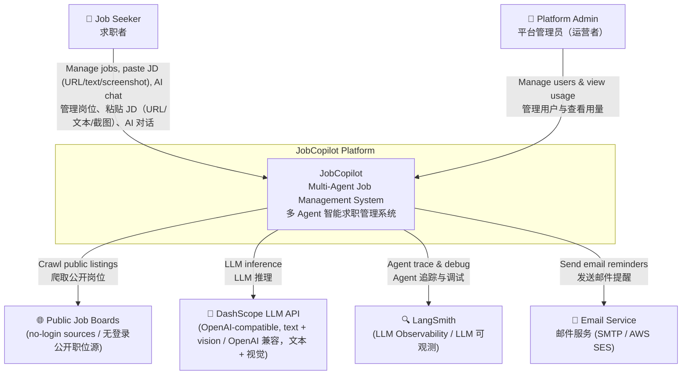

### 2.2 Level 2 — Container Diagram / 容器图

### 2.3 Level 3 — Agent Service Components / Agent Service 组件图

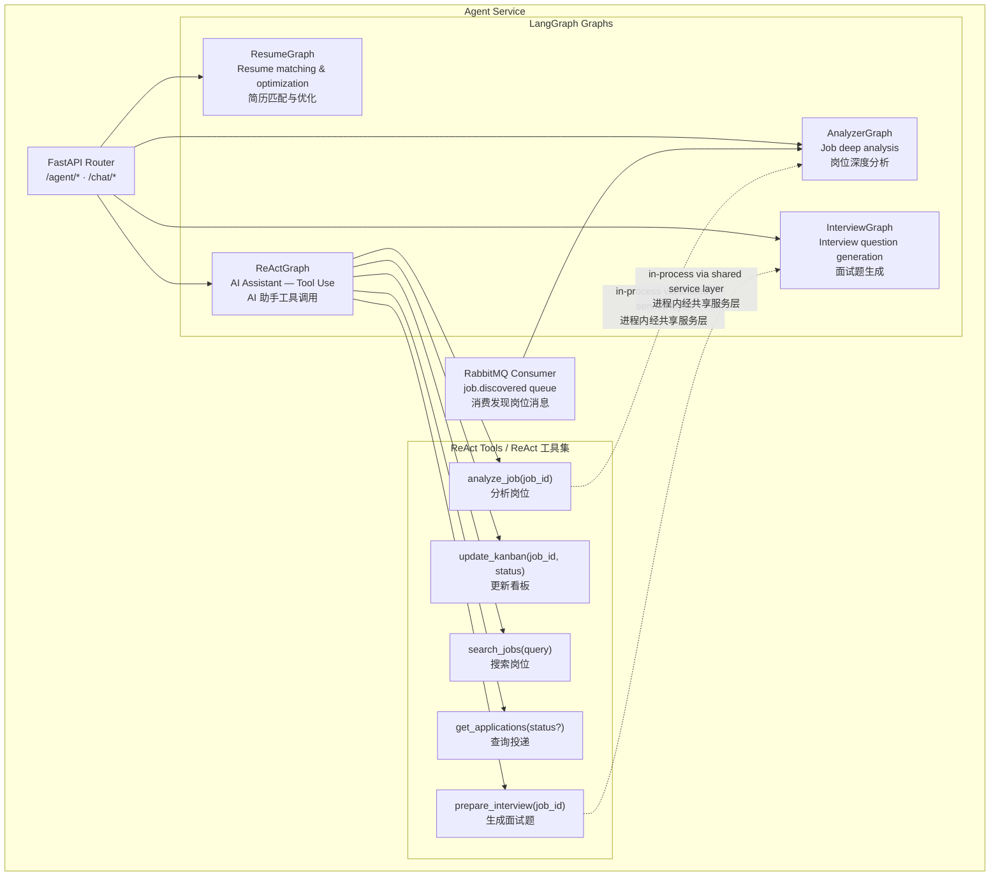

**EN:** Tools bind to real, tested Job Service `/internal/*` endpoints or run in-process through the shared service layer (`services/analysis.py` / `interview.py` / `matching.py`) — the same code paths the `/v1/agent/*` endpoints use. HTTP self-calls to the Agent Service itself are forbidden. Tool activity (`tool_call` / `tool_result` SSE events) is streamed live to the chat UI. See the AI Assistant Tool Contract in `CLAUDE.md` for the authoritative binding table.

**中文：** 工具绑定真实存在、有测试覆盖的 Job Service `/internal/*` 端点，或经共享服务层进程内执行（与 `/v1/agent/*` 端点共用代码路径）；禁止对 Agent Service 自身发起 HTTP 自调用。工具调用过程（`tool_call` / `tool_result` SSE 事件）实时透出到聊天 UI。权威绑定表见 `CLAUDE.md` 的「AI 助手工具契约」。

---

## 3. AI Agent Architecture / AI Agent 体系

**EN:**  
Four LangGraph graphs share a common DashScope LLM client. The JD screenshot entry uses a vision-capable model (e.g. qwen-vl) via the same OpenAI-compatible endpoint. Temporal handles durability and scheduling; LangGraph handles agent reasoning logic. These two frameworks are complementary, not competing.

**中文：**  
四个 LangGraph 图共享同一个 DashScope LLM 客户端。JD 截图入口经同一 OpenAI 兼容端点调用视觉模型（如 qwen-vl）。Temporal 负责耐久性与调度，LangGraph 负责 Agent 推理逻辑，两者互补而非竞争。

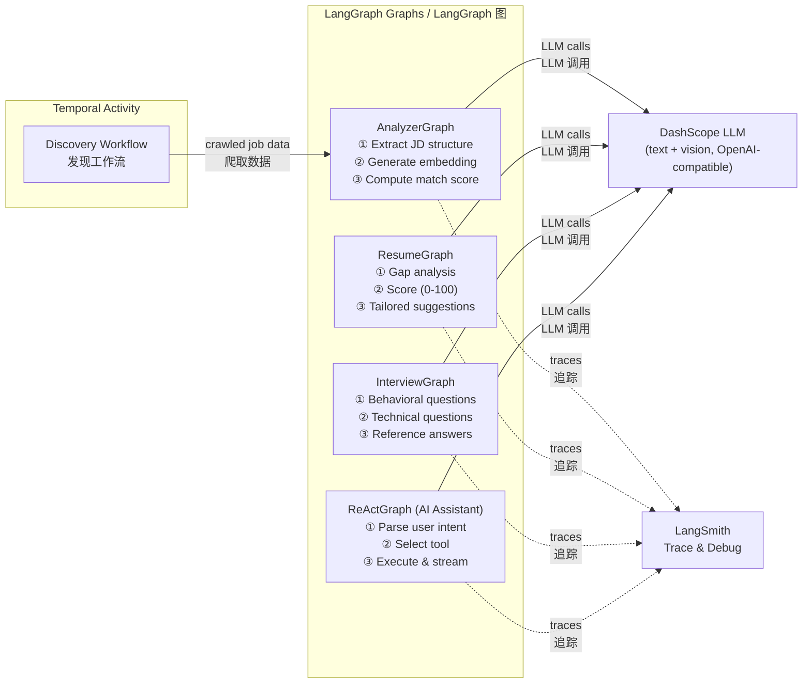

---

## 4. Temporal Workflow Design / Temporal 工作流设计

**EN:**  
Discovery workflows are the primary use of Temporal. Each Activity is independently retryable with configurable backoff, so a transient source failure does not re-crawl from the beginning. Sources are public, no-login job boards — no credential validation step exists.

**中文：**  
岗位发现工作流是 Temporal 的主要应用场景。每个 Activity 均可独立重试并配置退避策略，源站暂时性失败不会导致从头重爬。爬取源为无登录公开职位站点——不存在凭证校验环节。

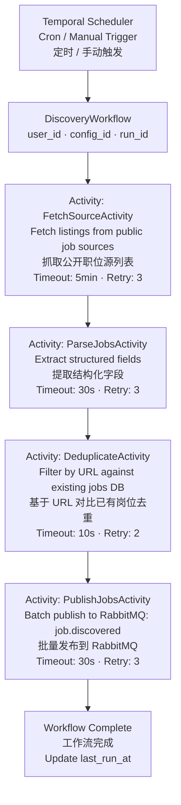

---

## 5. Key Sequence Diagrams / 关键流程时序图

### 5.1 Auto Job Discovery / 自动岗位发现

**EN:** Contract note: `job.discovered` events carry **no job_id**. The consumer (Agent Service) first upserts the job via `POST /internal/jobs` — an idempotent upsert by URL — to obtain the authoritative `job_id`, then analyzes and stores results keyed by that id.

**中文：** 契约要点：`job.discovered` 事件**不含 job_id**。消费方（Agent Service）先调用按 URL 幂等 upsert 的 `POST /internal/jobs` 换取权威 `job_id`，再执行分析并以该 id 存储结果。

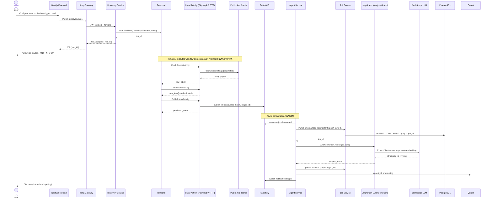

### 5.2 AI Assistant Tool Call / AI 助手工具调用

**EN:** Tools execute synchronously within the chat turn: internal Job Service endpoints over HTTP, or in-process graph invocation for the Agent Service's own capabilities. `tool_call` / `tool_result` SSE events are forwarded through the Next.js `/api/chat` proxy (mapped to Vercel AI SDK data-stream parts) and rendered in the chat UI.

**中文：** 工具在对话轮次内同步执行：Job Service 内部端点走 HTTP，Agent Service 自身能力进程内调用图。`tool_call` / `tool_result` SSE 事件经 Next.js `/api/chat` 代理（映射为 AI SDK 数据流部分）在聊天 UI 中渲染。

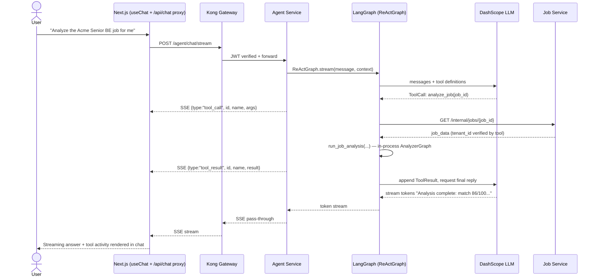

### 5.3 Resume Matching Analysis / 简历匹配分析

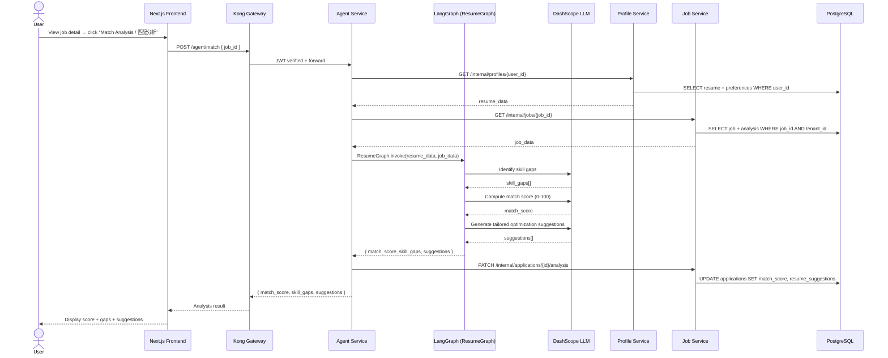

### 5.4 Notification Reminder Trigger / 通知提醒触发

**EN:** Email is the only active channel. Redis provides send-deduplication. (In-app center and IM webhooks are deferred — see PRD §6.)

**中文：** 邮件为唯一启用渠道，Redis 负责发送去重。（站内通知中心与 IM Webhook 暂缓——见 PRD §6。）

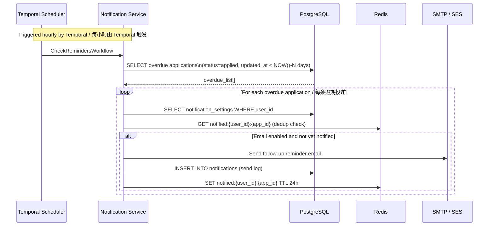

---

## 6. Application Status Machine / 投递状态机

**EN:**  
All status transitions are persisted to `application_events` with a timestamp. Transitions from `Rejected` and `Withdrawn` are terminal. The transition state machine is enforced server-side (including for AI-assistant tool calls).

**中文：**  
所有状态转换均记录到 `application_events` 表并附时间戳。`Rejected` 和 `Withdrawn` 为终止状态。状态机在服务端强制（包括 AI 助手工具调用路径）。

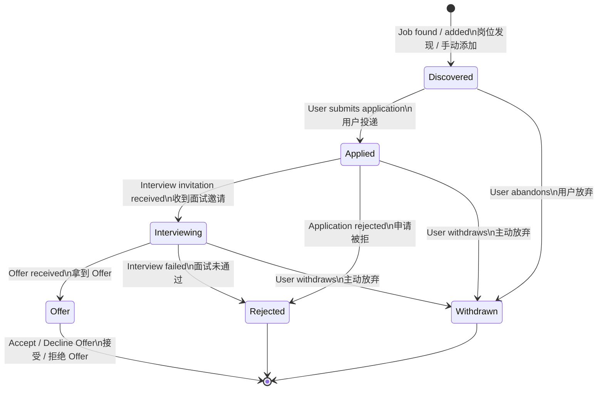

---

## 7. Data Model / 数据模型

**EN:**  
All tables include `tenant_id` where applicable. Every query against tenant-scoped tables **must** include `WHERE tenant_id = :tenant_id`. Cross-schema JOINs are forbidden; inter-service data exchange uses internal APIs. Each user is provisioned as their own tenant. `profiles.llm_api_key_enc` is used in self-hosted mode only (AES-256-GCM).

**中文：**  
所有表在适用时均含 `tenant_id`。针对租户范围表的每条查询**必须**包含 `WHERE tenant_id = :tenant_id`。禁止跨 Schema JOIN，服务间数据交换通过内部 API 进行。每个用户即一个租户。`profiles.llm_api_key_enc` 仅自部署形态使用（AES-256-GCM）。

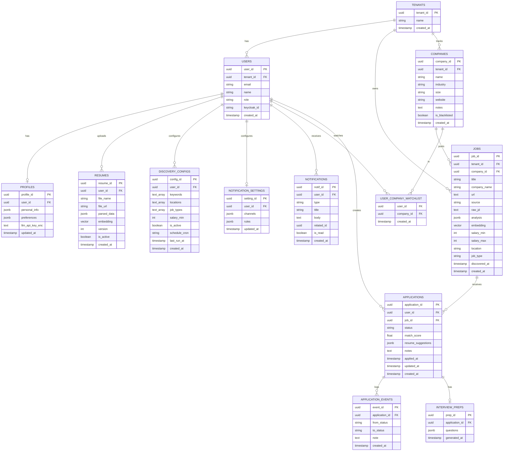

---

## 8. Inter-Service Communication / 服务间通信规范

**EN:**

| Pattern | Usage | Details |
|---|---|---|
| Sync (internal) | Service-to-service API calls | Direct container DNS (not through Kong); timeout 500ms |
| Async | Job discovery → AI analysis | RabbitMQ `job.discovered` queue; at-least-once delivery; event carries **no job_id** (consumer upserts first) |
| Async | AI analysis done → notification | RabbitMQ `notification.trigger` queue |
| Streaming | AI chat responses + tool activity | Server-Sent Events (SSE) from Agent Service |

**中文：**

| 模式 | 用途 | 详细 |
|---|---|---|
| 同步（内部） | 服务间 API 调用 | 容器 DNS 直连（不经 Kong）；超时 500ms |
| 异步 | 岗位发现 → AI 分析 | RabbitMQ `job.discovered` 队列；at-least-once 投递；事件**不含 job_id**（消费方先 upsert） |
| 异步 | AI 分析完成 → 通知 | RabbitMQ `notification.trigger` 队列 |
| 流式 | AI 聊天响应 + 工具过程 | Agent Service 输出 SSE |

**Queue Definitions / 队列定义：**

| Queue | Producer | Consumer | Dead Letter Queue |
|---|---|---|---|
| `job.discovered` | Discovery Service | Agent Service | `job.discovered.dlq` |
| `notification.trigger` | Agent Service | Notification Service | `notification.dlq` |

All event payloads are defined as shared Pydantic models in `jobcopilot_shared.events` — publishers construct them, consumers validate against them. / 所有事件负载在 `jobcopilot_shared.events` 中以共享 Pydantic 模型定义——发布方构造、消费方校验。

---

## 9. Observability Design / 可观测性设计

**EN:**  
Logs and metrics are implemented; distributed tracing (Tempo + OpenTelemetry) is on the roadmap. Metric names are prefixed with `jobcopilot_` and identical across services (distinguished by the scrape `job` label). LangGraph traces are forwarded to LangSmith for AI-specific debugging.

**中文：**  
日志与指标已实现；分布式追踪（Tempo + OpenTelemetry）在 roadmap。指标名称统一前缀 `jobcopilot_`，各服务同名（以抓取 `job` 标签区分）。LangGraph 追踪转发至 LangSmith 用于 AI 专项调试。

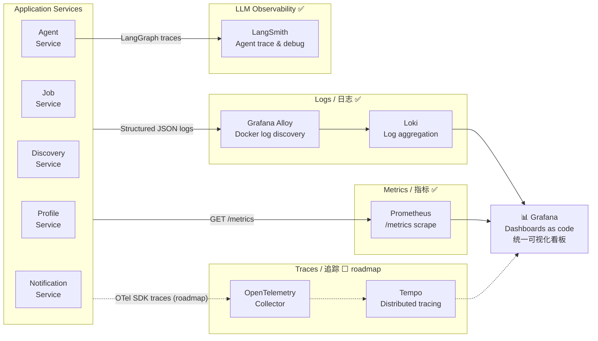

**Required Metrics / 必需指标：**

| Metric | Type | Description |
|---|---|---|
| `jobcopilot_http_requests_total` | Counter | Total HTTP requests by service/endpoint/status |
| `jobcopilot_http_request_duration_seconds` | Histogram | Request latency |
| `jobcopilot_llm_calls_total` | Counter | Total LLM calls by graph/model |
| `jobcopilot_llm_call_duration_seconds` | Histogram | LLM call latency |
| `jobcopilot_crawl_jobs_discovered_total` | Counter | Jobs discovered per crawl run |
| `jobcopilot_mq_messages_consumed_total` | Counter | RabbitMQ messages consumed by queue |
| `jobcopilot_active_temporal_workflows` | Gauge | Active Temporal workflow count |

---

## 10. Security Design / 安全设计

**EN:**

| Area | Requirement |
|---|---|
| Authentication | Keycloak 26 OIDC; JWT RS256; access token TTL 15 min; refresh token TTL 7 days; JWKS validated in every service with issuer/audience checks |
| Authorization | Roles: `user` / `premium` (reserved) / `admin` (platform); all tenant-scoped queries include `tenant_id` filter |
| Credential storage | User LLM API keys (self-hosted mode) encrypted with AES-256-GCM before persistence; plaintext never logged |
| SQL injection | Parameterized queries (SQLAlchemy prepared statements) everywhere; string-interpolated SQL is forbidden |
| Input validation | Pydantic schema validation on all API inputs; malformed requests rejected at the API layer |
| Container security | Multi-stage Dockerfile; production stage uses `python:3.11-slim`; runs as non-root (`uid=1000`) |
| Secrets management | All secrets injected via environment variables / K8s Secrets; never baked into images or committed to Git |
| Network isolation | Production: internal services bound to loopback, only 80/443 public (Caddy). K8s path: NetworkPolicy per service |
| Rate limiting | Kong rate-limiting plugin: per-tenant sliding window |
| Crawling ethics | Public no-login sources only; robots.txt respected; no user credentials ever collected for crawling |

**中文：**

| 领域 | 要求 |
|---|---|
| 认证 | Keycloak 26 OIDC；JWT RS256；访问令牌 TTL 15 分钟；刷新令牌 TTL 7 天；各服务基于 JWKS 校验（含 issuer/audience 检查） |
| 授权 | 角色：`user` / `premium`（预留）/ `admin`（平台）；所有租户范围查询必须含 `tenant_id` 过滤条件 |
| 凭证存储 | 用户 LLM API Key（自部署形态）持久化前 AES-256-GCM 加密；明文绝不写入日志 |
| SQL 注入防护 | 全链路 SQLAlchemy 参数化查询；禁止字符串拼接 SQL |
| 输入校验 | 所有 API 入参 Pydantic 校验；格式非法请求在 API 层拒绝 |
| 容器安全 | 多阶段 Dockerfile；生产阶段 `python:3.11-slim`；非 root 用户运行（uid=1000） |
| 密钥管理 | 所有密钥通过环境变量 / K8s Secrets 注入；禁止打入镜像或提交 Git |
| 网络隔离 | 生产：内部服务仅绑定回环地址，公网只开放 80/443（Caddy）。K8s 路径：按服务 NetworkPolicy |
| 限流 | Kong rate-limiting 插件：按租户滑动窗口限流 |
| 爬取伦理 | 只爬无登录公开源；遵守 robots.txt；绝不为爬取收集用户凭证 |

---

## 11. Deployment Architecture / 部署架构

**EN:**  
**Current production** is a single-node Docker Compose deployment (Hetzner) behind a Caddy TLS edge: CI builds and Trivy-scans images to GHCR; `infra/scripts/deploy.sh` resolves tags to immutable digests and ships over SSH; internal services bind to loopback only. All services are stateless, so the **Kubernetes manifests** (`infra/k8s/`) remain the horizontal-scaling path: Agent Service scales via KEDA on RabbitMQ queue depth; Profile and Job Services via HPA on CPU.

**中文：**  
**当前生产**为 Caddy TLS 边缘之后的单节点 Docker Compose 部署（Hetzner）：CI 构建镜像并经 Trivy 扫描推送 GHCR；`infra/scripts/deploy.sh` 将 tag 解析为不可变 digest 后经 SSH 下发；内部服务仅绑定回环地址。所有服务无状态，因此 **Kubernetes 清单**（`infra/k8s/`）作为水平扩容路径保留：Agent Service 基于 RabbitMQ 队列深度由 KEDA 伸缩，Profile / Job Service 基于 CPU 由 HPA 伸缩。

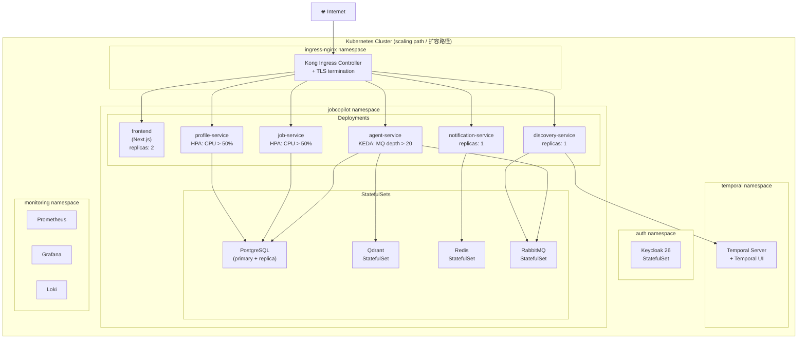

**K8s Resource Checklist / K8s 资源清单要求：**

Every application service must provide / 每个应用服务须提供：
- `Deployment` with `terminationGracePeriodSeconds ≥ 30`
- `Service` (ClusterIP)
- `ConfigMap` (non-secret config)
- `HPA` or `ScaledObject` (KEDA)
- `PodDisruptionBudget` (minAvailable: 1)
- `Ingress` / `HTTPRoute` (via Kong)
- Liveness probe: `GET /healthz/live`
- Readiness probe: `GET /healthz/ready`

---

## 12. Architecture Decision Records / 架构决策记录 (ADR)

### ADR-001: LangGraph for AI Agent Orchestration

**Status:** Accepted (re-affirmed 2026-07-11 after evaluating Pydantic AI and OpenAI Agents SDK)

**EN:** LangGraph is selected because it provides stateful, graph-based agent execution with conditional edges, native streaming, checkpointing/time-travel debugging, and first-class LangSmith tracing integration — the strongest node/state-transition observability among current frameworks, which matches the operator's requirement to inspect agent behavior without reading code. Alternatives (Pydantic AI, OpenAI Agents SDK, CrewAI) lack equivalent persistence and debugging depth.

**中文：** 选用 LangGraph：有状态图式执行、条件边、原生流式、检查点/时间旅行调试，以及 LangSmith 一等公民追踪——节点/状态流转可观测性为当前框架中最强，契合运营者"不读代码也能审视 Agent 行为"的要求。备选方案（Pydantic AI、OpenAI Agents SDK、CrewAI）无对等的持久化与调试深度。2026-07-11 经对比评估后再次确认。

---

### ADR-002: Temporal for Workflow Orchestration

**Status:** Accepted

**EN:** Temporal handles durable execution for long-running crawl workflows. It provides built-in retry semantics, timeouts, and visibility—replacing fragile ad-hoc retry loops. LangGraph and Temporal are used together: Temporal manages workflow lifecycle; LangGraph runs within Temporal Activities for AI reasoning.

**中文：** Temporal 负责长时运行爬取工作流的耐久执行，提供内建重试语义、超时控制和可见性，取代脆弱的自定义重试逻辑。Temporal 与 LangGraph 配合使用：Temporal 管理工作流生命周期，LangGraph 在 Temporal Activity 内执行 AI 推理。

---

### ADR-003: Qdrant for Vector Storage

**Status:** Accepted

**EN:** Qdrant is chosen over pgvector because it provides dedicated ANN indexing, multi-tenancy via named collections or payload filters, and scales independently of the relational database. pgvector remains available via PostgreSQL for lightweight similarity needs.

**中文：** 选用 Qdrant 而非 pgvector，因为 Qdrant 提供专用 ANN 索引、通过命名集合或 payload 过滤实现多租户隔离，并可独立于关系型数据库扩展。pgvector 仍通过 PostgreSQL 保留，用于轻量级相似度需求。

---

### ADR-004: Per-User LinkedIn Cookie (Not Shared Account)

**Status:** ~~Accepted~~ **Superseded by ADR-006 (2026-07-11)**

**EN:** Originally, each user supplied their own LinkedIn Session Cookie for Playwright crawling. This was superseded: credential-based crawling of login-walled platforms puts users' real accounts at ban risk, violates platform ToS, and is structurally fragile against anti-bot escalation. See ADR-006.

**中文：** 原方案为每用户提供自己的 LinkedIn Session Cookie 供 Playwright 爬取。已被取代：凭证式爬取登录墙平台使用户真实账号面临封禁风险、违反平台服务条款，且在反爬升级面前结构性脆弱。见 ADR-006。

---

### ADR-005: Vercel AI SDK + assistant-ui for Chat Frontend

**Status:** Accepted

**EN:** Vercel AI SDK (`useChat`) handles the SSE streaming protocol and tool-call lifecycle on the frontend. `assistant-ui` provides headless, accessible chat components (Thread, Message, ToolResult) that integrate natively with Vercel AI SDK and support shadcn/ui theming. This avoids building chat UI infrastructure from scratch.

**中文：** Vercel AI SDK (`useChat`) 处理前端 SSE 流式协议和工具调用生命周期。`assistant-ui` 提供 headless、无障碍聊天组件（Thread、Message、ToolResult），与 Vercel AI SDK 原生集成，支持 shadcn/ui 主题。避免从零搭建聊天 UI 基础设施。

---

### ADR-006: Credential-Free Job Discovery (Supersedes ADR-004)

**Status:** Accepted (2026-07-11)

**EN:** The platform never collects or uses user account credentials for crawling. Automated discovery is limited to public, no-login job sources (crawl-friendly boards, respecting robots.txt). Login-walled content enters the system only through user-initiated manual paths: paste a URL (with graceful degradation to text paste when unfetchable), paste JD text, or paste a JD screenshot (multimodal parsing). Rationale: shifts risk from "user's real account gets banned" (unacceptable, borne by users) to "our crawler IP gets rate-limited" (acceptable, borne by the platform); removes the ToS/legal exposure of simulated logins; removes the cookie-management UX barrier that gated user activation.

**中文：** 平台绝不为爬取收集或使用用户账号凭证。自动发现仅限无登录公开职位源（对爬虫友好的站点，遵守 robots.txt）。登录墙内容只经用户主动的手动路径进入系统：粘贴 URL（无法抓取时优雅降级为文本粘贴）、粘贴 JD 文本、粘贴 JD 截图（多模态解析）。理由：将风险从"用户真实账号被封"（不可接受，由用户承担）转为"平台爬虫 IP 被限流"（可接受，由平台承担）；消除模拟登录的 ToS/法律暴露；移除 Cookie 配置这一卡在用户激活最前端的门槛。

---

### ADR-007: Dual Deployment Modes for LLM Key Sourcing

**Status:** Accepted (2026-07-11)

**EN:** The project is open source and defines two deployment modes, switched by configuration: **self-hosted** (users/operator configure their own OpenAI-compatible API key, encrypted at rest) and **hosted site** (platform-provided key only; the BYO-key UI is hidden). The mode flag controls both the key source used by the Agent Service and whether the credentials UI exposes API-key configuration. Per-user quota enforcement on the hosted site is a deferred prerequisite for large-scale open registration (PRD §6).

**中文：** 项目开源，按配置切换两种部署形态：**自部署**（用户/部署者自配 OpenAI 兼容 Key，加密存储）与**托管站**（只用平台 Key，隐藏自带 Key 界面）。形态开关同时控制 Agent Service 的 Key 来源与设置页是否展示 API Key 配置。托管站按用户配额强制为暂缓项，是大规模开放注册的前提（PRD §6）。
